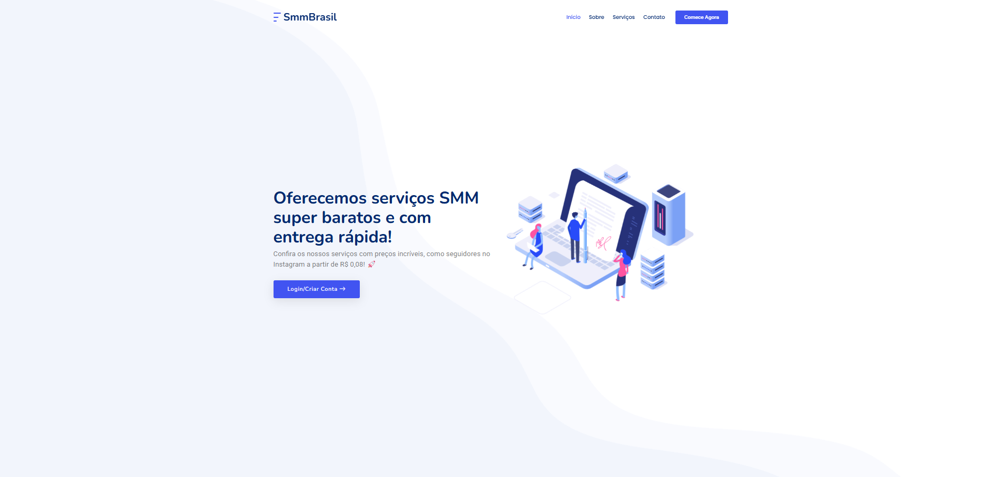
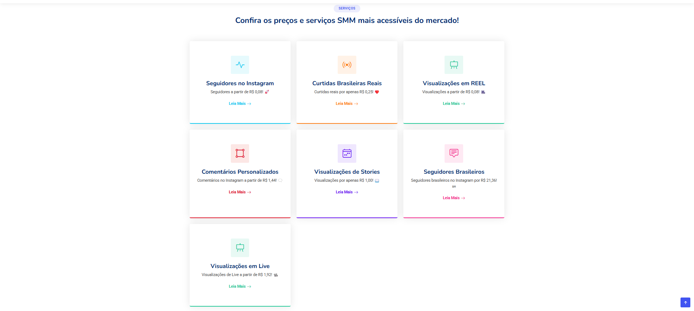
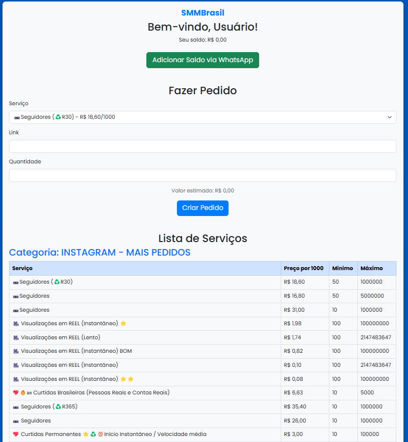
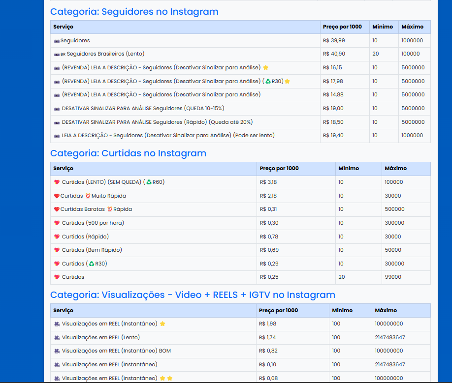

# 📢 SMM Automação - API VerifiedSc Atacado

O **SMM Automação** é um sistema completo para gerenciamento de serviços SMM, integrando diretamente com a API do [VerifiedSc Atacado](https://verifiedscatacado.com/api). Ele permite aos usuários **comprar seguidores, curtidas, visualizações e outros serviços de redes sociais** de forma automatizada.

---

## 🎯 **Principais Recursos**
✅ **Integração direta com a API** do VerifiedSc Atacado.  
✅ **Site responsivo e adaptável** a dispositivos móveis e desktops.  
✅ **Todos os serviços do provedor oficial estão disponíveis**.  
✅ **Execução automática de ordens baseada no saldo do usuário**, com possibilidade de ajuste.  
✅ **Painel de pedidos**, listagem de serviços e gerenciamento de saldo integrado.  
✅ **Design moderno e otimizado**, inspirado em plataformas SMM profissionais.  

---

## 💻 **Como Funciona?**
1️⃣ O usuário acessa o site e escolhe um serviço.  
2️⃣ O sistema verifica o saldo disponível e permite a compra.  
3️⃣ O pedido é enviado automaticamente para a API do VerifiedSc Atacado.  
4️⃣ O usuário acompanha o progresso da compra pelo painel.  

🔗 **Exemplo do site em funcionamento:** [smmbrasil.company](https://smmbrasil.company/)  

---

## 📷 **Capturas de Tela**
Aqui estão algumas imagens do projeto em ação:

### 📌 **Página Inicial**


### 📌 **Lista de Serviços**


### 📌 **Plataformas Suportadas**


### 📌 **Painel de Pedidos**


### 📌 **Preços e Serviços**


---

## 🔧 **Tecnologias Utilizadas**
🛠 **Frontend:** HTML, CSS, JavaScript  
🛠 **Backend:** PHP, Node.js  
🛠 **Banco de Dados:** MySQL  
🛠 **API:** VerifiedSc Atacado  

---

## 🛠 **Configuração e Uso**
1. **Clone o repositório**
   ```bash
   git clone https://github.com/seuusuario/smm-automacao.git
   cd smm-automacao
